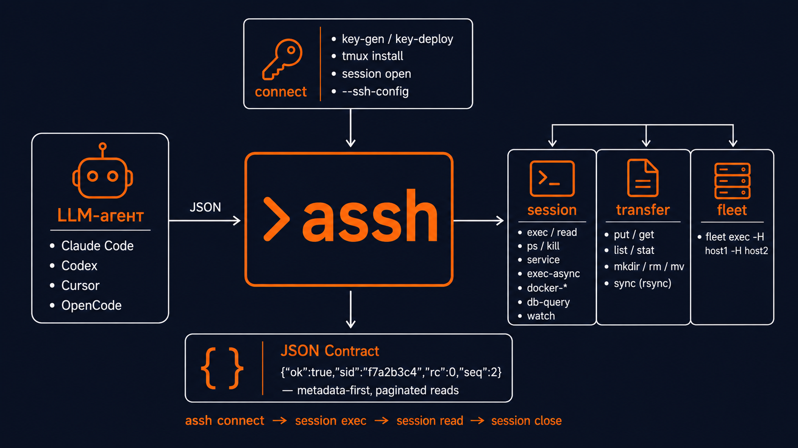

# assh

[](https://github.com/izzzzzi/agent-assh/actions/workflows/ci.yml)
[](https://github.com/izzzzzi/agent-assh/releases)
[](https://www.npmjs.com/package/agent-assh)
[](LICENSE)

Language: English | [Русский](README.md)

SSH workflow helper for LLM agents.

`assh` bootstraps SSH access, opens a persistent remote `tmux` session, and keeps large SSH output out of the agent context. Commands return compact JSON metadata first; agents read only the lines they need.

<p align="center">
  
</p>

## Quick Start

```bash
npm i -g agent-assh
assh version --check  # check for updates

export TARGET_PASS="..."
assh connect -H 203.0.113.10 -u root -E TARGET_PASS -n deploy
unset TARGET_PASS
```

If key login already works, `assh connect` does not read `TARGET_PASS`.

```bash
assh connect -H 203.0.113.10 -u root -i ~/.ssh/id_agent_ed25519 -n deploy
```

If you have a provider server-info block, save it to a local file and let `assh` parse it:

```bash
assh connect-info --file server.txt -n deploy
```

`connect` returns a session id and `next_commands`:

```json
{
  "ok": true,
  "sid": "f7a2b3c4",
  "session": "deploy",
  "tmux_name": "assh_f7a2b3c4",
  "next_commands": {
    "exec": "assh session exec -s f7a2b3c4 -- \"pwd\"",
    "read": "assh session read -s f7a2b3c4 --seq 1 --limit 50",
    "close": "assh session close -s f7a2b3c4"
  }
}
```

Continue through the session API:

```bash
assh session exec -s f7a2b3c4 -- "pwd"
assh session read -s f7a2b3c4 --seq 1 --limit 50
assh session close -s f7a2b3c4
```

## Installing the assh Skill into AI Agents

The assh skill teaches AI coding agents to use assh efficiently for SSH work.
After install, the agent automatically uses assh for all SSH tasks.

| Agent | Install |
| --- | --- |
| **Claude Code** | `/plugin marketplace add izzzzzi/agent-assh` then `/plugin install assh@assh` |
| **Codex** | `codex plugin marketplace add izzzzzi/agent-assh` |
| **Cursor** | Copy `.cursor/rules/assh.mdc` to your project's `.cursor/rules/` |
| **Cline** | Copy `.clinerules/assh.md` to your project root |
| **Copilot CLI** | `copilot plugin marketplace add izzzzzi/agent-assh` then `copilot plugin install assh@assh` |
| **OpenCode** | Add `"plugin": ["./.opencode/plugins/assh.mjs"]` to `opencode.json` |
| **Pi** | `pi install git:github.com/izzzzzi/agent-assh` |
| **Any agent** | The `AGENTS.md` file at the repo root provides universal instructions |

Via `ctx7`:

```bash
ctx7 skills install /izzzzzi/agent-assh assh
```

## What connect Does

`assh connect`:

- creates or reuses `~/.ssh/id_agent_ed25519` unless `--identity` is set;
- tries key login first;
- uses `--password-env` only when key login fails;
- deploys the public key and verifies key login;
- probes remote capabilities;
- installs `tmux` non-interactively unless `--no-install-tmux` is set;
- runs safe cleanup for old trusted `assh` sessions unless `--no-gc` is set;
- opens a trusted `tmux` session and saves local registry metadata.

## Commands

- `assh connect`: first-contact bootstrap and session open.
- `assh connect-info`: parse a pasted provider server-info block and connect.
- `assh session exec|read|close|gc`: persistent tmux workflow.
- `assh session ps|kill`: process management.
- `assh session service`: service management (status/restart/start/stop/logs).
- `assh session exec-async|job-status|job-cancel`: background jobs.
- `assh session docker-ps|docker-logs|docker-exec`: Docker management.
- `assh session db-query`: read-only MySQL/PostgreSQL queries.
- `assh session watch`: human observability into the agent's tmux session.
- `assh exec`: run one remote command and store output locally.
- `assh read`: read stored output with pagination or `--raw`.
- `assh transfer put|get|read|list|stat|mkdir|rm|mv|sync`: file ops and sync. `transfer read` reads a remote text file over ssh and returns an `output_id` for paginated `assh read`.
- `assh forward`: port forwarding (start/status/stop).
- `assh fleet exec`: parallel execution across multiple hosts.
- `assh scan`: return host inventory JSON (OS, CPU, memory, disk, uptime).
- `assh capabilities`: inspect remote session support.
- `assh key-deploy`: low-level key deployment using a password from env.
- `assh audit`: read local audit events with `--last`, `--host`, and `--failed`.
- `assh version`: print version metadata.

## Token Economy

Use metadata first, then read targeted output windows:

```bash
assh session exec -s f7a2b3c4 -- "journalctl -p warning"
assh session read -s f7a2b3c4 --seq 1 --limit 50
assh session read -s f7a2b3c4 --seq 1 --stream stderr --limit 50
```

Use `--raw` only for piping or exact output:

```bash
assh session read -s f7a2b3c4 --seq 1 --raw
```

`assh audit --savings` reports how many output lines were withheld from context by
pagination (a line metric, not tokens):

```bash
assh audit --savings
# {"ok":true,"reads":12,"raw_lines":5000,"served_lines":600,"withheld_lines":4400}
```

## Agent CLI Examples

Paste this instruction into Codex, Claude Code, OpenCode, or another terminal agent before sharing SSH details:

```text
Use `assh` for SSH work.

If I paste a provider server-info block, save the exact block to a temporary file with mode 0600, run:
assh connect-info --file TMP -n NAME
then delete TMP.

If `connect-info` cannot parse the block, extract host, user, and password yourself. Put the password in a temporary environment variable and run:
assh connect -H HOST -u USER -E PASSWORD_ENV -n NAME
then unset the variable.

Never print, log, summarize, or repeat passwords. Use the returned sid and `next_commands` for all remote work.
```

Minimal per-tool prompts:

```text
Codex: Use `assh` for all SSH access. For pasted server info, prefer `assh connect-info --file TMP -n NAME`; keep secrets out of command arguments and replies.
```

```text
Claude Code: Before SSH work, install/run `assh`. If server credentials are pasted, store them in a 0600 temp file, run `assh connect-info --file TMP -n NAME`, delete the file, and continue with the returned sid.
```

```text
OpenCode: Use `assh connect-info` for provider server-info blocks and `assh session exec/read` after connect. Never echo passwords.
```

## Security

- Passwords are accepted only through environment variables. There is no `--password` flag.
- Output is redacted by default (AWS keys, JWTs, bearer tokens, PEM keys, `password=`/`token=` assignments) into `[REDACTED:type]`, with `"redacted":true` in JSON. This is best-effort hygiene, **not** a security boundary. Disable with `--no-redact`.
- Declarative safety policy: operators can add denied commands in `~/.config/assh/safety.rules` (one command name per line). The file only **adds** denials and never relaxes built-in rules; it must be mode `0600` or loading fails closed (`safety_policy_invalid`).
- `connect-info` reads passwords only from stdin or a local file and never from command arguments.
- If key login works, `connect` does not read the password env var.
- Password values are not written to audit logs.
- Command text is not written to audit logs; audit entries use command hashes.
- SSH runs non-interactively and disables pseudo-terminal allocation.
- `--host-key-policy accept-new` is the default. Use `strict` for hardened environments.
- `--host-key-policy no-check` is unsafe and should be limited to disposable lab/dev hosts.
- `session exec` blocks clearly destructive commands such as `rm -rf`, `find ... -delete`, `mkfs`, `wipefs`, dangerous `dd`, and recursive permission changes; intentional runs require `--confirm-danger`.
- Remote cleanup only targets sessions with trusted `assh` metadata.

## Advantages

- One command handles first login, key setup, tmux readiness, cleanup, and session open.
- ControlMaster connection pooling — repeat calls reuse the SSH socket.
- Large output stays outside the agent context until explicitly paged in.
- Persistent sessions preserve working directory and environment between commands.
- JSON responses are stable for agent parsing.
- Built-in command safety classifier blocks destructive operations.
- Background jobs via tmux (exec-async).
- Read-only database queries with write protection.

## Limitations

- `tmux` sessions are for Unix-like remotes.
- Package installation is non-interactive; unsupported package managers return machine-readable errors.
- Interactive password prompts are not supported in v1.
- `assh` uses the system OpenSSH client.

## Manual Install

`npm i -g agent-assh` installs a wrapper that downloads the matching Go binary from GitHub Releases. You can also download release archives manually from:

```text
https://github.com/izzzzzi/agent-assh/releases
```

## Russian

See [README.md](README.md).
